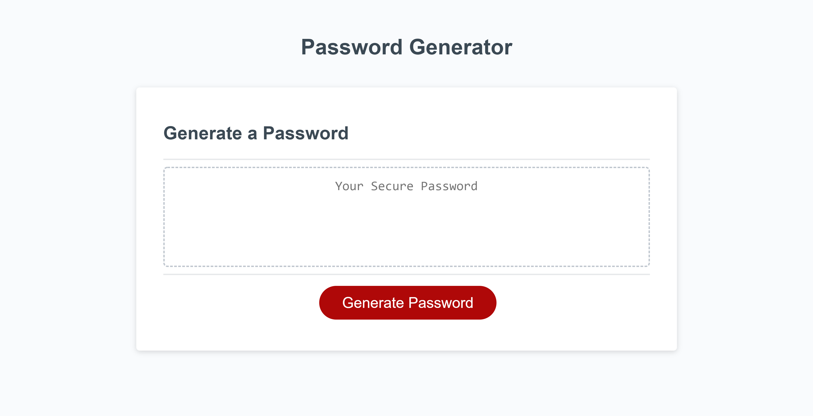

# Password-Generator-03

## Deployed Website
https://krysmit.github.io/Password-Generator-03/
## GitHub Repository
https://github.com/krysmit/Password-Generator-03

### Project Summary
This project was to edit starter code in order to give people access to generating a randomized password after a button is clicked and they chose specifications for their code.

### Functions of this page that meet the critera:
* When the button is clicked, promts begin for password criteria.
* Prompts include password length between  8 - 128 characters, lower case letters, upper case letters, and/or special characters.
* A password is generated once all choices are made.
* The password is written on the page at the end.